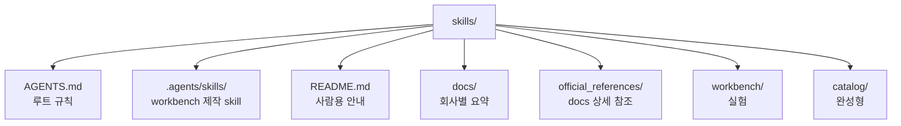
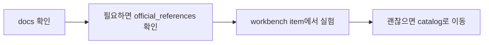

# AI Agent Guidance Workshop

이 프로젝트는 AI 에이전트용 `AGENTS.md`와 `SKILL.md`를 작성, 실험, 관리하기 위한 프로젝트다.

## 구조



## 작업 흐름



## 예시

```text
skills/
├── AGENTS.md : 이 저장소 규칙
├── .agents/skills/ : workbench 제작 skill
├── README.md : 프로젝트 안내
├── docs/ : Agents.md/Skill의 공통규격, 회사/모델(버젼)별 차이 요약
├── official_references/ : docs의 근거가 되는 공식 문서.
│   ├── openai/
│   ├── anthropic/
│   └── shared/
├── workbench/ : workbench item 모음
│   └── codex-generic-guidance/ : 범용 Codex item
│       ├── AGENTS.md : item 규칙
│       └── .agents/
│           └── skills/
│               └── when-writes-documentation/ : item skill
└── catalog/ : 완성형
```
