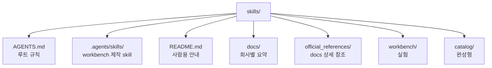
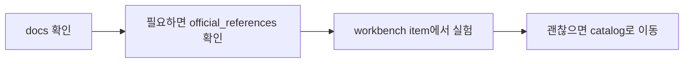

# AI Agent Harness Repository

이 프로젝트는 AI 에이전트의 행동을 제한하고 작업 흐름을 고정하기 위한 harness 문서를 설계, 실험, 관리, 백업하기 위한 저장소다.
여기서 harness 문서는 `AGENTS.md`, `SKILL.md`, 그리고 그와 함께 동작하는 관련 문서 묶음을 포함한다.

## 구조



## 작업 흐름



## 예시

```text
skills/
├── AGENTS.md : 이 저장소 규칙
├── .agents/skills/ : harness 제작 skill
├── README.md : 프로젝트 안내
├── docs/ : harness 문서의 공통규격, 회사/모델(버젼)별 차이 요약
├── official_references/ : harness 문서 규칙의 근거가 되는 공식 문서
│   ├── openai/
│   ├── anthropic/
│   └── shared/
├── workbench/ : workbench item 모음
└── catalog/ : 승격된 harness 패키지와 백업본
    └── codex-global-harness-backup/ : 전역 Codex 백업/기본 harness 묶음
        ├── AGENTS.md : 전역 정책
        ├── .agents/
        │   └── skills/ : 전역 공통 skill
        └── superpowers/ : 커스텀 workflow 번들
```

## Credits

- `superpowers` custom workflow bundle is based on [`obra/superpowers`](https://github.com/obra/superpowers).
- `obra/superpowers` is distributed under the MIT License.
