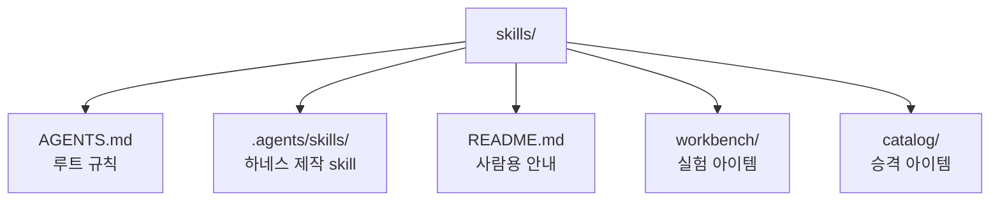
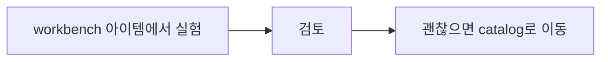

# AI Agent Harness Repository

이 프로젝트는 LLM 에이전트가 특정 프로젝트나 환경에서 일하는 방식을 정하는 하네스를 설계, 실험, 관리, 백업하기 위한 저장소다.

## 용어

- 하네스: LLM 에이전트의 작업 방식을 정하는 운영 패키지. 지침, 스킬, 커스텀 에이전트, 도구 연결, 설정, 작업 규칙, 검증 규칙, identity 규칙, 복구/설치 안내를 포함할 수 있다.
- 루트 하네스: 이 저장소에서 워크벤치 아이템과 카탈로그 아이템을 만들고 검토하고 승격하기 위한 루트 수준의 하네스.
- 아이템: `workbench/<name>/` 또는 `catalog/<name>/`에 있는 개별 폴더. 각 아이템 안에 독립 하네스 파일과 설정이 들어간다.

## 구조



## 작업 흐름



## 예시

```text
skills/
├── AGENTS.md : 이 저장소 규칙
├── .agents/skills/ : 하네스 제작 skill
├── README.md : 프로젝트 안내
├── workbench/ : 실험 중인 아이템
│   └── codex-global-harness-backup/ : 전역 Codex 백업 하네스가 들어 있는 아이템
│       ├── AGENTS.md : 전역 정책
│       ├── .agents/
│       │   └── skills/ : 전역 공통 skill
│       └── .codex/
│           └── agents/ : Codex custom agent profile
└── catalog/ : 승격된 아이템
```

## Credits

- `superpowers` custom workflow bundle is based on [`obra/superpowers`](https://github.com/obra/superpowers).
- `obra/superpowers` is distributed under the MIT License.
