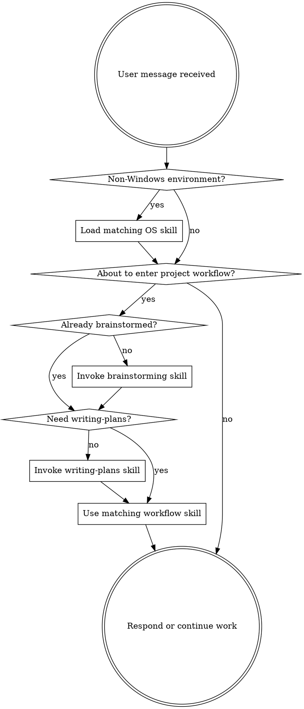

<SUBAGENT-STOP>
If you were dispatched as a subagent to execute a specific task, skip this skill.
</SUBAGENT-STOP>

<IMPORTANT>
Use superpowers as the default workflow for project work in this bundled package.
Do not let superpowers override higher-level home policy or repository-local policy.
</IMPORTANT>

## Instruction Priority

Use this order:

1. the parent harness package `AGENTS.md` policy layer
2. repository-local and project-local `AGENTS.md`
3. direct task requirements from the current request
4. superpowers workflow defaults

Do not add extra meta-priority claims here. This skill only routes work into the workflow.

## How to Access Skills

**In Codex:** Use Codex skill loading and follow the loaded skill directly.

## Environment Gate

Default guidance is Windows-first only for Windows environments.

If the current environment is not Windows, load one of these skills before interpreting shell snippets, filesystem paths, or install steps:

- `using-macos-environment`
- `using-linux-environment`
- `using-wsl-environment`

When a skill uses upstream tool names, translate them using `references/codex-tools.md`.

# Using Skills

## The Rule

For project work, use this flow:

1. `brainstorming` decides what to build.
2. `writing-plans` decides how to build it.
3. `execution` starts only after both are complete.

Check whether a superpowers skill clearly applies before entering project workflow or taking implementation action.

## Red Flags

These thoughts mean STOP and re-check policy and workflow:

| Thought | Reality |
|---------|---------|
| "Superpowers decides policy" | Home and local `AGENTS.md` decide policy. |
| "The same shell guidance works everywhere" | Windows guidance and non-Windows OS skills are separate. Branch to an OS skill first on non-Windows environments. |
| "I can keep pushing forward even if planning changed the target" | Return to `brainstorming` when the target changes. |
| "This work doesn't need the workflow" | Project work still uses the workflow unless a more specific local workflow replaces it. |

## Skill Priority

When multiple workflow skills could apply, use this order:

1. **Process skills first** (brainstorming, debugging) - these determine HOW to approach the task
2. **Planning skills second** (writing-plans) - these lock implementation decisions
3. **Execution skills third** (executing-plans, subagent-driven-development) - these guide implementation

"Let's build X" → brainstorming first, then writing-plans.
"Fix this bug" → systematic-debugging first if the issue is repeated or unclear.

## Skill Types

**Rigid** (TDD, debugging): Follow exactly. Don't adapt away discipline.

**Flexible** (patterns): Adapt principles to context.

The skill itself tells you which.

## User Instructions

Instructions say WHAT, not HOW. "Add X" or "Fix Y" doesn't mean skip workflows.
