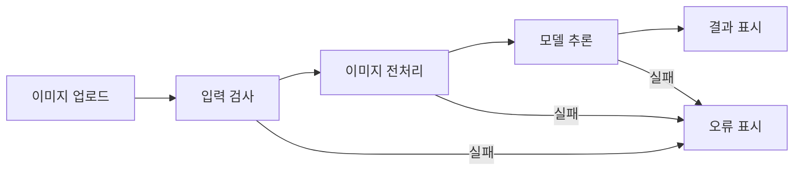

# 관측 가능한 데이터 중심의 바이브 코딩 가이드라인

코드 작업을 책임 단위로 나누고 관측 증거로 검증하기

이 문서는 스킬이나 하네스가 아닌 프로젝트별 가이드라인이다. 프로젝트의 목표, 기술 스택, 규모에 맞게 단계, 단위, 관측 데이터를 조정해 적용한다.

## A. 관측 가능한 데이터와 단위

### 1. 공통 언어: 관측 가능한 데이터

관측 가능한 데이터는 사용자와 AI가 함께 확인하고 같은 말로 가리킬 수 있는, 직접 확인하거나 측정·계산·비교할 수 있는 구체적인 입력, 출력, 상태, 증거다. 이는 사용자와 AI가 해석 차이 없이 대화하기 위한 기본 어휘이며, AI가 수행한 작업의 결과를 이해하고 판단하는 기초가 된다.

| 종류 (예시) | 예 |
|---|---|
| 화면과 이미지 | 이미지, HTML UI, 목업, 스크린샷, 화면 영역과 상태 |
| 값과 비교 기준 | 입력값, 출력값, 수치해, 성능 수치, 허용 조건, 벤치마크 비교 |
| 실행 신호 | 처리 상태, 로그, 오류 메시지, 테스트 결과 |
| 기술 스택에서 보이는 값 | 데이터 형식, shape·dtype·device, 라이브러리·CUDA 버전 |

이 데이터는 책임 단위, 테스트 가능 단위, 마일스톤 내부 단위의 입출력·상태·판정 증거로 사용한다.

### 2. 해상도: 사용자 수준에서 개발 수준으로

사용자는 처음에는 UI, 이미지, 스크린샷처럼 사용자 수준의 관측 가능한 데이터로 AI와 대화한다. 단계가 진행될수록 AI의 도움을 받아 데이터 형식과 자료형, 입출력 형태, 상태, 오류 메시지, 로그처럼 개발에 가까운 관측 가능한 데이터로 대화하고 AI의 작업을 감독할 수 있게 되는 것을 목표로 한다.

### 3. 단위: 책임 단위에서 마일스톤 내부 단위로

> 책임 단위 → 테스트 가능 단위 → 마일스톤 내부 단위

사용자가 감당할 수 있는 단위란 그 단위의 책임과 관측 가능한 입출력·상태를 설명하고, 입력이나 조건을 바꿨을 때 나올 데이터를 예측하며, 실제 관측 데이터에서 가능한 원인과 검증 방법을 세워 AI에게 의심할 영역을 지정할 수 있는 범위다.

- 책임 단위는 요구사항의 동작을 하나의 책임과 예측 가능한 입출력으로 나눈 것이다.
- 테스트 가능 단위는 입력이나 조건의 변화에 따른 출력과 실패를 예측하고 검증 방법을 세울 수 있도록 구체화한 책임 단위다.
- 마일스톤 내부의 구현 단위와 검증 단위는 테스트 가능 단위 하나, 테스트 가능 단위의 조합 또는 더 크게 묶은 단위다.
- 서로 간의 관계는 책임 단위가 설계에서 테스트 가능 단위로 구체화되고, 계획에서는 여러 테스트 가능 단위를 마일스톤으로 묶는 것이다.

여기서 테스트 가능 단위는 꼭 테스트를 실행한다는 뜻은 아니다. 책임, 동작, 입출력을 테스트로 설계하고 이용할 수 있을 만큼 이해한 단위이며, 필요하면 실제 테스트로 실행할 수 있다.

### 4. 목적: AI 작업을 감독하는 청사진

이 파이프라인의 궁극적인 목적은 복잡한 요구 작업을 이러한 단위와 그 조합으로 환원하고, AI의 작업을 중간 관측 지점마다 확인하고 통제할 수 있는 청사진을 만드는 것이다.

## B. 핵심 단계

### 1. 느낌 구체화

**목적:** 사용자가 원하는 것을 아직 명확히 말하기 어려운 상태에서 사용자와 AI가 공통으로 가리킬 관측 가능한 데이터와 용어를 만들고 방향을 좁힌다.

**방법 예:**

- 목업, 이미지, 기존 사례, 간단한 데모를 함께 본다.
- 사용자와 AI가 같은 화면, 수치, 상태, 오류를 같은 말로 가리킨다.
- 사용자가 원하는 방향을 관측 가능한 데이터로 표현한다.

### 2. 요구사항 분석

**목적:** 원하는 동작을 책임 단위의 입력, 정상 출력, 실패 출력으로 설명하고 기술 스택을 선택할 기준을 정한다.

**방법 예:**

- 좁혀진 방향을 구체적이고 단순한 입출력 동작이 있는 프로토타입으로 확인한다.
- 원하는 동작을 입력과 정상·실패 결과를 예측할 수 있는 책임 단위로 나눈다.
- 필요한 성능·실행 환경·대표 오류와 그 관측 데이터를 기준으로 기술 스택을 비교하고 선택한다.
- 선택한 기술 스택의 기본 실행, 입출력 형태, 로그와 대표 오류를 확인한다.

### 3. 설계

**목적:** 책임 단위를 테스트 가능 단위로 구체화하고, 사용자가 입출력과 실패 신호를 따라갈 수 있는 블록 구조와 규모를 정한다.

**방법 예:**

- 선택한 기술 스택에서 관측할 수 있는 입출력과 실패를 붙여 책임 단위를 테스트 가능 단위로 구체화한다.
- 테스트 가능 단위를 조합한 흐름을 사용자가 따라갈 수 있는 범위에서 설계 규모를 정한다.

### 4. 계획

**목적:** 테스트 가능 단위와 그 조합을 마일스톤 내부 단위로 배치하고, AI의 작업을 판정하고 중단 후 재개할 수 있는 체크리스트를 만든다.

**방법 예:**

- 마일스톤의 구현 단위와 검증 단위를 테스트 가능 단위 하나 또는 조합으로 이해할 수 있게 배치한다.
- 각 마일스톤에 종료 조건과 관측 가능한 판정 증거를 붙인다.

### 퀴즈와 피드백

> 예측 → 관찰 → 설명 → 입력·조건·단위 조합 변경

AI는 구체적인 입력, 상태, 관측 결과를 제시한다. 사용자는 예상 출력이나 주어진 출력의 가능한 원인을 값·화면·로그까지 포함해 서술한다. 오답은 설명을 보강하고 단위의 크기와 조합을 조정하는 데 사용한다.

| 단계 | 표에 제시된 관측 가능한 데이터로 묻는 질문 |
|---|---|
| 느낌 구체화 | 어떤 사례와 화면 영역이 원하는 방향에 가까운가? |
| 요구사항 분석 | 이 입력 데이터를 주면 어느 책임 단위에서 어떤 출력 데이터가 나오는가? |
| 설계 | 이 출력이나 오류가 나온 가능한 원인은 무엇이며, 어떤 디버깅 가설과 검증 방법을 AI에게 지시할 것인가? |
| 계획 | 이 구현·검증 단위의 관측 데이터로 마일스톤 통과를 판정할 수 있는가? |

## C. 예시: 이미지를 올리면 고양이 또는 개로 분류하고 신뢰도를 표시하는 웹앱

### 1. 느낌 구체화

#### 관측 자료로 방향 좁히기

1. 이미지 한 장을 올리고 분류명만 보여주는 화면
2. 여러 이미지를 올리고 분류명과 신뢰도를 표로 보여주는 화면
3. 미리보기, 처리 중 표시, 결과 카드, 오류가 있는 화면

**질문 예:** “각 화면에서 원하는 부분을 골라 주세요.”

사용자는 한 장 업로드, 분류명과 신뢰도, 미리보기와 처리 중 표시를 선택한다. 사용자와 AI는 화면 영역을 `업로드`, `미리보기`, `처리 상태`, `결과 카드`, `오류`라고 부르기로 한다.

### 2. 요구사항 분석

#### 프로토타입으로 원하는 동작 찾기

1. JPG나 PNG 한 장을 선택하면 미리보기가 나온다.
2. 분류 버튼을 누르면 처리 중 표시가 나온다.
3. 잠시 뒤 `고양이 92%` 또는 `개 87%`가 나온다.
4. TXT 파일을 선택하면 업로드 영역에 오류가 나온다.

#### 동작을 책임 단위로 나누기

| 책임 단위 | 입력 | 정상 데이터 | 실패 데이터 |
|---|---|---|---|
| 이미지 받기 | 사용자가 고른 파일 | 파일 이름과 미리보기 | 파일 읽기 오류 |
| 입력 검사 | 파일 형식과 크기 | 검사 통과 | 형식·크기 오류 |
| 이미지 분류 | 검사된 이미지 | 분류명과 신뢰도 | 분류 실패 상태 |
| 결과 표시 | 분류 결과 또는 오류 | 결과 카드 또는 오류 메시지 | 화면 표시 오류 |

| 질문에 사용할 관측 데이터 | 값 |
|---|---|
| 선택한 파일 | `notes.txt`, `text/plain`, 12KB |

**질문 예:** “표의 `notes.txt`, `text/plain`, 12KB를 입력으로 주면 미리보기, 처리 상태, 결과 카드, 오류 영역에 각각 어떤 관측 데이터가 나오며 어느 책임 단위에서 멈출까요?”

#### 품질 기준과 기술 스택 선택

선정 기준은 JPG·PNG 입력, 2초 이내 응답, GPU 사용, 입력 형태와 실패 로그 확인이다.

| 후보 | 관측 가능한 데이터 | 제약 |
|---|---|---|
| NumPy | 배열 shape·dtype·값 | 모델 실행과 GPU 처리를 별도로 구성해야 함 |
| Keras | 입력 shape, 예측값, 실행 로그 | 세부 Tensor와 장치 동작은 백엔드와 함께 확인해야 함 |
| PyTorch | shape·dtype·device, 모델 출력, CUDA 오류 | 확인해야 할 실행 요소가 많음 |

Tensor와 GPU 동작을 직접 확인하기 위해 PyTorch를 선택한다.

#### 선택한 기술 스택 경험하기

`cat.jpg`가 shape `[1,3,224,224]`, dtype `float32`인 Tensor로 바뀌고 모델이 shape `[1,2]`인 점수를 내는지 확인한다. PyTorch·CUDA 버전, GPU 사용 여부와 오류 로그 위치도 함께 확인한다.

| 질문에 사용할 관측 데이터 | 값 |
|---|---|
| 모델 입력 | shape `[1,3,224,224]`, dtype `float32`, device `cpu` |
| 준비된 모델 | device `cuda:0` |

**질문 예:** “표의 모델 입력과 준비된 모델로 추론하면 어떤 오류가 관측될까요? 가능한 원인, AI에게 전달할 디버깅 가설, 가설을 검증할 입력·로그는 무엇인가요?”

### 3. 설계

#### 책임 단위를 테스트 가능 단위로 구체화하기

책임 단위의 입출력과 실패를 선택한 기술 스택에서 관측할 수 있는 값으로 구체화한다.

| 테스트 가능 단위 | 입력 | 정상 데이터 | 실패 데이터 |
|---|---|---|---|
| 입력 검사 | 파일 형식·크기 | 검사된 이미지 | 형식·크기 오류 |
| 이미지 전처리 | 검사된 이미지 | `[1,3,224,224]` Tensor | 디코딩·shape 오류 |
| 모델 추론 | Tensor | 클래스별 점수 | device·모델 로딩 오류 |
| 결과 표시 | 클래스와 신뢰도 또는 오류 | 결과 카드 또는 오류 메시지 | 응답 형식·표시 오류 |

#### 블록 흐름 정하기

#### 규모 조정 퀴즈

| 질문에 사용할 관측 데이터 | 값 |
|---|---|
| 이미지 전처리 출력 | shape `[1,224,224,3]`, dtype `float32` |
| 모델이 받는 입력 | shape `[1,3,224,224]`, dtype `float32` |

**질문 예:** “표의 이미지 전처리 출력을 모델에 주면 어느 테스트 가능 단위에서 어떤 오류가 관측될까요? 가능한 원인과 이를 검증하기 위해 AI가 비교할 두 shape는 무엇인가요?”

사용자가 흐름과 실패 위치를 따라갈 수 있는 범위에서 블록을 나누거나 묶는다.

#### 설계 결과

- 프로젝트 구조와 블록 위치
- 블록 연결과 데이터·오류 흐름
- 블록별 입출력과 대표 실패
- 테스트 가능 단위와 블록 조합의 판정 기준

### 4. 계획

마일스톤의 구현 단위와 검증 단위는 테스트 가능 단위 하나 또는 조합으로 구성한다. 각 마일스톤에는 관측 가능한 판정 증거와 종료 조건을 붙인다.

#### 예시 계획

| 마일스톤 | 구현 단위 | 검증 단위 | 종료 조건과 증거 |
|---|---|---|---|
| M1 입력 처리 | 입력 검사와 전처리 구현 | 정상 이미지 통과, TXT·초과 크기 거부 | 테스트 통과, Tensor 값, UI 오류 |
| M2 분류 | 모델 추론 구현 | 정상 점수, device·모델 로딩 오류 | 테스트 통과, 모델 출력, 오류 로그 |
| M3 연결 | 업로드부터 결과 표시까지 연결 | 정상·실패 전체 흐름 | 통합 테스트 통과, 결과 화면, 로그 |

#### 계획 퀴즈

| 질문에 사용할 관측 데이터 | 상태 |
|---|---|
| 정상 추론 판정 테스트 | 통과 |
| device 불일치 판정 테스트 | 실행하지 않음 |

**질문 예:** “표의 두 검증 단위 상태로 M2를 완료로 판정할 수 있나요? 빠진 관측 데이터와 다음 검증 단위는 무엇인가요?”

#### 진행 체크리스트

계획 단계에서 구현 중 갱신할 체크리스트를 만든다.

##### M2 분류

- [ ] 모델 추론 구현
- [ ] 정상 입력 테스트
- [ ] device 불일치 테스트
- [ ] 모델 로딩 실패 테스트
- [ ] 결과와 로그 기록
- [ ] 종료 조건 확인

**상태:** 대기 | 작업 중 | 실패·차단 | 검증 완료  
**현재 작업:**  
**마지막으로 통과한 테스트:**  
**현재 관측 데이터 또는 오류:**  
**다음 작업:**
