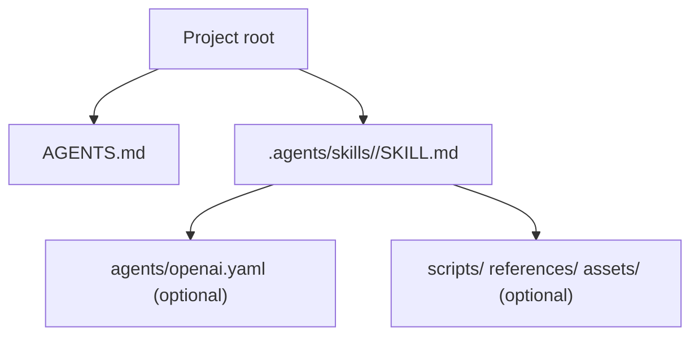
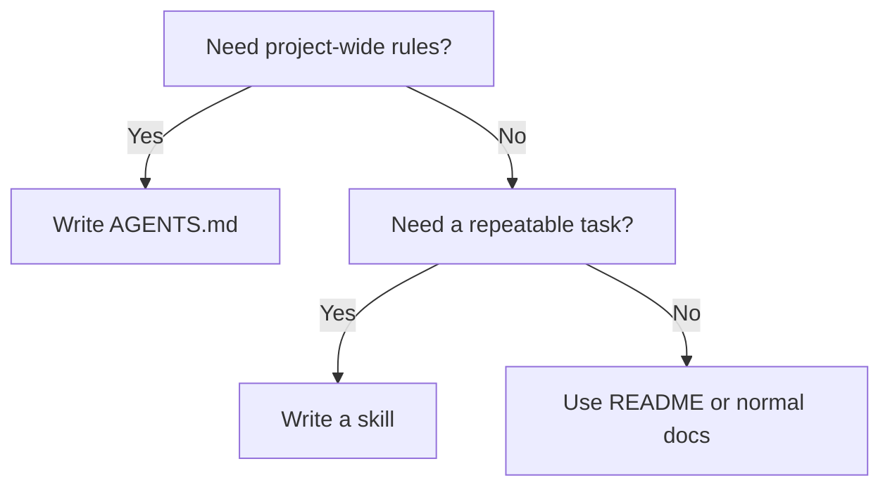

# OpenAI Skills

## OpenAI skill structure

## Skills for OpenAI Codex

- Codex looks at `name` and `description` first, then reads the body only after the skill is chosen.
- A skill can trigger by explicit mention such as `$skill-name` or by a matching `description`.
- Repo-local skills are discovered by scanning `.agents/skills` from the current folder up to the repository root.
- Keep `description` short and clear about what the skill does and when to use it.
- Put procedures in the body, not in the `description`.

## What OpenAI's repo shows

- The official repo groups skills under `skills/`.
- `.system/` contains built-in skills for Codex.
- `.curated/` contains installable skills.
- Latest Codex installs `.system/` skills automatically.
- `.curated/` skills are installed through `$skill-installer`.
- Built-in and installable skills use the same basic skill folder shape.
- The repo treats a skill as a reusable task unit, not as a full project guide.

## Practical rule

## Sources

- Codex AGENTS.md guide: <https://developers.openai.com/codex/guides/agents-md> — checked on 2026-03-21
- Codex Skills guide: <https://developers.openai.com/codex/skills> — checked on 2026-03-21
- openai/skills: <https://github.com/openai/skills> — checked on 2026-03-21
