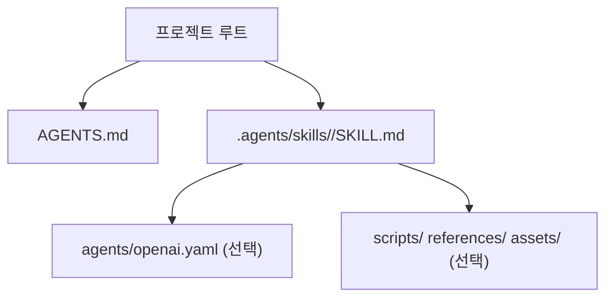
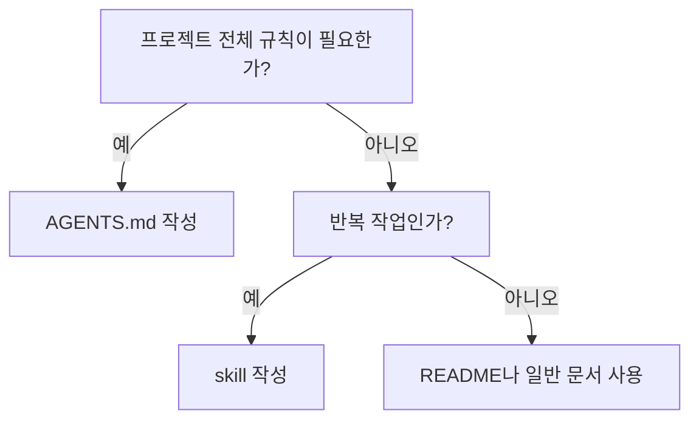

# OpenAI Skills

## OpenAI skill 구조

## OpenAI Codex용 Skills

- Codex는 먼저 `name`과 `description`을 보고, skill이 선택된 뒤에만 본문을 읽는다.
- skill은 `$skill-name`처럼 명시적으로 부르거나, `description`이 잘 맞을 때 자동으로 선택될 수 있다.
- 프로젝트 로컬 skill은 현재 폴더에서 저장소 루트까지의 `.agents/skills`를 스캔해 발견된다.
- `description`은 skill이 무엇을 하고 언제 쓰는지 짧고 분명하게 적는다.
- 절차는 `description`이 아니라 본문에 적는다.

## OpenAI 공식 저장소에서 보이는 점

- 공식 저장소는 skill을 `skills/` 아래에 모아 둔다.
- `.system/`에는 Codex 기본 내장 skill이 들어 있다.
- `.curated/`에는 설치 가능한 skill이 들어 있다.
- 최신 Codex는 `.system/` skill을 자동 설치한다.
- `.curated/` skill은 `$skill-installer`로 설치한다.
- 기본 내장 skill과 설치형 skill은 같은 기본 폴더 구조를 쓴다.
- OpenAI 저장소는 skill을 전체 프로젝트 설명서가 아니라 재사용 가능한 작업 단위로 다룬다.

## 실전 판단

## 출처

- Codex AGENTS.md guide: <https://developers.openai.com/codex/guides/agents-md> — 확인일 2026-03-21
- Codex Skills guide: <https://developers.openai.com/codex/skills> — 확인일 2026-03-21
- openai/skills: <https://github.com/openai/skills> — 확인일 2026-03-21
