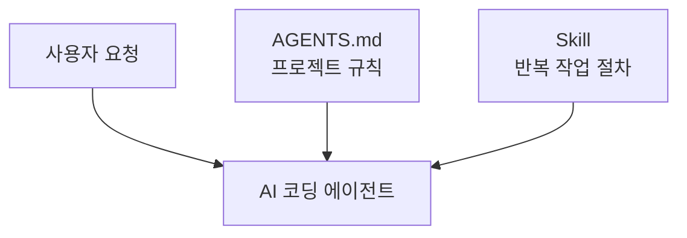
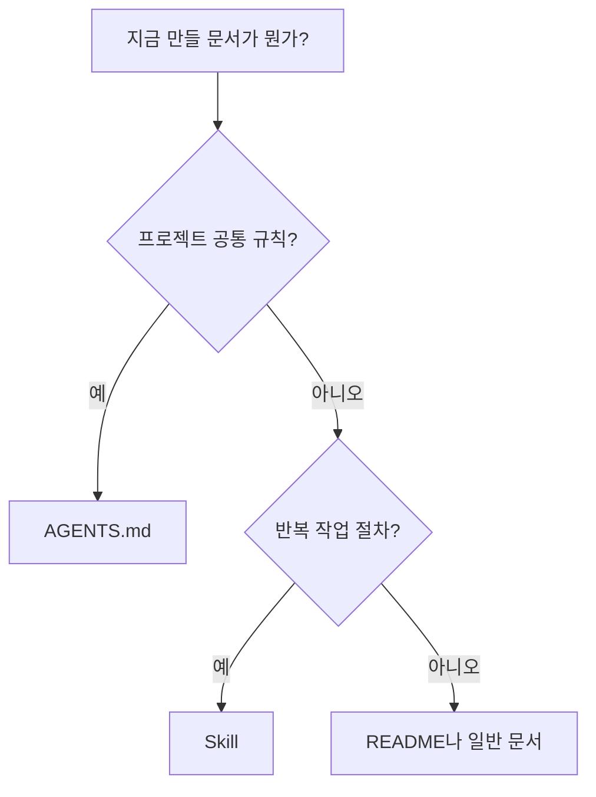
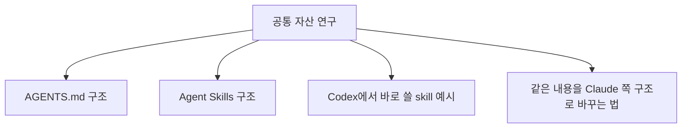

# AGENTS.md와 Skills 쉬운 안내서

공식 파일 이름은 `agent.md`가 아니라 `AGENTS.md`다.

## 1. AI 에이전트 공통 내용

### 공통 규격 같은 게 있나

- 완전히 하나로 통일된 국제표준이 있는 것은 아니다.
- 대신 여러 도구가 함께 쓰기 쉬운 공통 형식에 가까운 것들은 있다.
  - `AGENTS.md`: 프로젝트 규칙을 적는 Markdown 파일
  - `Agent Skills`: `SKILL.md` 중심의 skill 폴더 구조

### 핵심만 보기



- `AGENTS.md`: 프로젝트 전체 규칙
- `Skill`: 반복 작업 절차

### 언제 무엇을 쓰나



### 최소 규격

#### AGENTS.md

- 그냥 Markdown 파일이다.
- 보통 프로젝트 루트에 둔다.
- 공통 규칙만 적는다.
- 하위 폴더만 예외면 그쪽에 `AGENTS.override.md`를 둔다.

#### Skill

- `.agents/skills/<skill-name>/SKILL.md`가 중심이다.
- `SKILL.md`에는 최소한 아래 두 항목이 필요하다.

```yaml
name: skill-name
description: 무엇을 하고 언제 쓰는지 설명
```

- 필요하면 `references/`, `scripts/`, `assets/`, `agents/openai.yaml`를 붙인다.

### 저장 위치 공통 관례

| 항목 | 많이 쓰는 위치 |
| --- | --- |
| 프로젝트 규칙 | `./AGENTS.md` |
| 하위 폴더 예외 | `subdir/AGENTS.md` 또는 `subdir/AGENTS.override.md` |
| 프로젝트 로컬 skills | `.agents/skills/<name>/SKILL.md` |
| 사용자 전역 skills | `~/.agents/skills/<name>/SKILL.md` 계열 |

- 중요한 점은 `Agent Skills` 스펙은 주로 파일 구조를 설명하고, 저장 경로는 도구마다 조금씩 다를 수 있다는 점이다.

## 2. Claude와 Codex 비교

### 한눈에 비교

| 비교 항목 | Codex | Claude |
| --- | --- | --- |
| 프로젝트 규칙 파일 이름 | `AGENTS.md` | `CLAUDE.md` 또는 `.claude/CLAUDE.md` |
| 프로젝트 규칙 탐색 | 현재 위치에서 위로 올라가며 가까운 `AGENTS.md`를 우선 사용 | 현재 위치에서 위로 올라가며 `CLAUDE.md`를 읽고, 하위 폴더는 필요할 때 읽음 |
| 하위 폴더 예외 처리 | 같은 폴더의 `AGENTS.override.md`가 우선 | 하위 폴더의 `CLAUDE.md`, `.claude/rules/`로 분리 가능 |
| 다른 파일 끌어오기 | 기본은 파일 자체를 직접 배치 | `@path/to/file` import 가능 |
| skill 저장 위치 | `.agents/skills/` 중심 | 구현에 따라 `.claude/skills/` 또는 `.agents/skills/` |

### 저장 경로 차이

#### 프로젝트 규칙 파일

| 구분 | Codex | Claude |
| --- | --- | --- |
| 프로젝트 루트 | `./AGENTS.md` | `./CLAUDE.md` 또는 `./.claude/CLAUDE.md` |
| 하위 폴더 규칙 | `subdir/AGENTS.md` 또는 `subdir/AGENTS.override.md` | `subdir/CLAUDE.md` |
| 사용자 전역 규칙 | 도구/환경에 따라 홈 디렉터리 지침 사용 가능 | `~/.claude/CLAUDE.md` |

#### skills

| 구분 | Codex | Claude 계열 관례 |
| --- | --- | --- |
| 프로젝트 로컬 | `.agents/skills/<name>/SKILL.md` | `.claude/skills/<name>/SKILL.md` 또는 `.agents/skills/<name>/SKILL.md` |
| 사용자 전역 | `~/.agents/skills/<name>/SKILL.md` 계열 | `~/.claude/skills/<name>/SKILL.md` 계열 가능 |

### 실제 배치 예시

#### Codex 예시

```text
my-project/
├── AGENTS.md
├── api/
│   └── AGENTS.override.md
└── .agents/
    └── skills/
        └── repo-checker/
            └── SKILL.md
```

#### Claude 예시

```text
my-project/
├── CLAUDE.md
└── .claude/
    ├── rules/
    │   ├── testing.md
    │   └── frontend/
    │       └── react.md
    └── skills/
        └── repo-checker/
            └── SKILL.md
```

### 같은 내용을 쓰는 방식 차이

#### Codex 쪽

```md
## Working agreements
- Run `npm test` after changing JavaScript files.
- Ask before adding new production dependencies.
```

#### Claude 쪽

```md
See @README for project overview and @package.json for available npm commands.

# Additional Instructions
- Run `npm test` before finishing.
```

- Codex는 파일 안에 규칙을 직접 적는 쪽이 더 흔하다.
- Claude는 import와 rules 분리를 같이 쓰는 경우가 많다.

## 3. Codex 전용

### `skill-creator`는 무엇인가

- `skill-creator`는 공통 규격이 아니라, Codex/OpenAI 쪽에서 skill 폴더를 빨리 만드는 도우미다.
- 즉 `SKILL.md` 형식 자체를 정의하는 문서가 아니라, 그 형식의 초안을 빠르게 만드는 도구다.

### 어떻게 쓰나


1. 만들고 싶은 skill 주제를 정한다.
2. `name`과 `description`을 먼저 정한다.
3. 기본 폴더를 만든다.
4. `SKILL.md`를 채우고 필요하면 `references/`, `scripts/`, `assets/`를 붙인다.
5. validator로 형식을 확인한다.

### 예시 명령

Windows PowerShell 기준:

```powershell
python <CODEX_HOME>\skills\.system\skill-creator\scripts\init_skill.py my-skill --path <PROJECT_PATH>\.agents\skills --resources references
python <CODEX_HOME>\skills\.system\skill-creator\scripts\quick_validate.py <PROJECT_PATH>\.agents\skills\my-skill
```

- 첫 줄: skill 뼈대 만들기
- 둘째 줄: 형식 검사

### 이 프로젝트에서 뭘 연구하면 되나



## 참고 자료

- 최신 정보를 다시 찾았으면 `Context7 조회일`이나 `확인일`을 같이 적어두는 게 좋다.
- [AGENTS.md](https://agents.md/)
- [Agent Skills Specification](https://agentskills.io/specification)
- [How to add skills support to your agent](https://agentskills.io/client-implementation/adding-skills-support)
- [Codex AGENTS.md guide](https://developers.openai.com/codex/guides/agents-md)
- [Codex Skills guide](https://developers.openai.com/codex/skills)
- [Claude Code memory / CLAUDE.md](https://docs.anthropic.com/en/docs/claude-code/memory)
