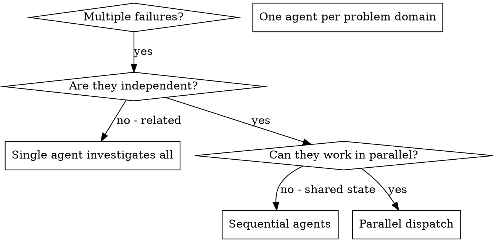

# Dispatching Parallel Agents

## 개요

전문 agent에게 격리된 context로 작업을 위임합니다. agent가 집중하고 성공하도록, 지시와 context를 정확히 구성하세요. agent는 현재 세션의 context나 history를 물려받으면 안 됩니다. 필요한 것만 직접 구성해 제공하세요. 이렇게 하면 자신의 context는 조율 작업에 보존됩니다.

서로 관련 없는 여러 실패가 있을 때, 순서대로 조사하면 시간이 낭비됩니다. 각 조사가 독립적이면 병렬로 진행할 수 있습니다.

**핵심 원칙:** 독립 문제 영역마다 agent 하나를 파견하세요. 동시에 작업하게 하세요.

## 사용할 때



**사용하세요:**

- 서로 다른 root cause로 3개 이상의 test file이 실패함
- 여러 subsystem이 독립적으로 깨짐
- 각 문제를 다른 문제의 context 없이 이해할 수 있음
- 조사 사이에 공유 상태가 없음

**사용하지 마세요:**

- 실패가 관련되어 있음: 하나를 고치면 다른 것도 고쳐질 수 있음
- 전체 system state 이해가 필요함
- agent들이 서로 간섭할 수 있음

## 패턴

### 1. 독립 영역 식별

무엇이 깨졌는지 기준으로 실패를 묶습니다.

- File A tests: Tool approval flow
- File B tests: Batch completion behavior
- File C tests: Abort functionality

각 영역은 독립적입니다. tool approval 수정은 abort tests에 영향을 주지 않습니다.

### 2. 집중된 agent 작업 만들기

각 agent에게 다음을 제공합니다.

- **Specific scope:** 하나의 test file 또는 subsystem
- **Clear goal:** 이 test들을 pass하게 만들기
- **Constraints:** 다른 code는 변경하지 않기
- **Expected output:** 발견한 것과 수정한 것의 요약

### 3. 병렬 파견

```typescript
// In a multi-agent environment
Task("Fix agent-tool-abort.test.ts failures")
Task("Fix batch-completion-behavior.test.ts failures")
Task("Fix tool-approval-race-conditions.test.ts failures")
// All three run concurrently
```

### 4. 검토와 통합

agent가 돌아오면:

- 각 summary를 읽습니다.
- fix가 충돌하지 않는지 확인합니다.
- full test suite를 실행합니다.
- 모든 변경을 통합합니다.

## Agent Prompt 구조

좋은 agent prompt는 다음 조건을 갖춥니다.

1. **Focused** - 명확한 문제 영역 하나
2. **Self-contained** - 문제 이해에 필요한 모든 context 포함
3. **Specific about output** - agent가 무엇을 반환해야 하는지 명확함

```markdown
Fix the 3 failing tests in src/agents/agent-tool-abort.test.ts:

1. "should abort tool with partial output capture" - expects 'interrupted at' in message
2. "should handle mixed completed and aborted tools" - fast tool aborted instead of completed
3. "should properly track pendingToolCount" - expects 3 results but gets 0

These are timing/race condition issues. Your task:

1. Read the test file and understand what each test verifies
2. Identify root cause - timing issues or actual bugs?
3. Fix by:
   - Replacing arbitrary timeouts with event-based waiting
   - Fixing bugs in abort implementation if found
   - Adjusting test expectations if testing changed behavior

Do NOT just increase timeouts - find the real issue.

Return: Summary of what you found and what you fixed.
```

## 흔한 실수

**X Too broad:** "Fix all the tests" - agent가 길을 잃습니다.
**O Specific:** "Fix agent-tool-abort.test.ts" - scope가 집중됩니다.

**X No context:** "Fix the race condition" - agent가 위치를 모릅니다.
**O Context:** error message와 test name을 붙여넣습니다.

**X No constraints:** agent가 모든 것을 refactor할 수 있습니다.
**O Constraints:** "Do NOT change production code" 또는 "Fix tests only"

**X Vague output:** "Fix it" - 무엇이 바뀌었는지 알 수 없습니다.
**O Specific:** "Return summary of root cause and changes"

## 사용하지 말아야 할 때

- **Related failures:** 하나를 고치면 다른 것도 고쳐질 수 있으면 먼저 함께 조사하세요.
- **Need full context:** 전체 system 이해가 필요합니다.
- **Exploratory debugging:** 무엇이 깨졌는지 아직 모릅니다.
- **Shared state:** agent들이 같은 file이나 resource를 사용해 서로 간섭합니다.

## 실제 세션 예시

**상황:** 대규모 refactoring 후 3개 file에서 6개 test failure 발생

**Failures:**

- `agent-tool-abort.test.ts`: 3 failures (timing issues)
- `batch-completion-behavior.test.ts`: 2 failures (tools not executing)
- `tool-approval-race-conditions.test.ts`: 1 failure (execution count = 0)

**결정:** abort logic, batch completion, race conditions는 독립 영역입니다.

**Dispatch:**

```text
Agent 1 -> Fix agent-tool-abort.test.ts
Agent 2 -> Fix batch-completion-behavior.test.ts
Agent 3 -> Fix tool-approval-race-conditions.test.ts
```

**Results:**

- Agent 1: timeout을 event-based waiting으로 교체
- Agent 2: event structure bug 수정 (`threadId` 위치 오류)
- Agent 3: async tool execution 완료 대기 추가

**Integration:** 모든 fix가 독립적이고 conflict가 없으며 full suite가 green입니다.

**Time saved:** 순차 진행 대신 3개 문제가 병렬로 해결되었습니다.

## 핵심 이점

1. **Parallelization** - 여러 조사가 동시에 일어납니다.
2. **Focus** - 각 agent는 좁은 scope를 가지며 추적할 context가 적습니다.
3. **Independence** - agent들이 서로 간섭하지 않습니다.
4. **Speed** - 1개 문제 시간에 3개 문제를 해결합니다.

## 검증

agent가 돌아온 뒤:

1. **Review each summary** - 무엇이 바뀌었는지 이해합니다.
2. **Check for conflicts** - agent들이 같은 code를 수정했는지 확인합니다.
3. **Run full suite** - 모든 fix가 함께 작동하는지 검증합니다.
4. **Spot check** - agent가 systematic error를 만들 수 있습니다.

## 실제 영향

Debugging session (2025-10-03):

- 3개 file에서 6개 failure
- 3개 agent를 병렬 파견
- 모든 조사가 동시에 완료됨
- 모든 fix가 성공적으로 통합됨
- agent 변경 사이 conflict 없음
