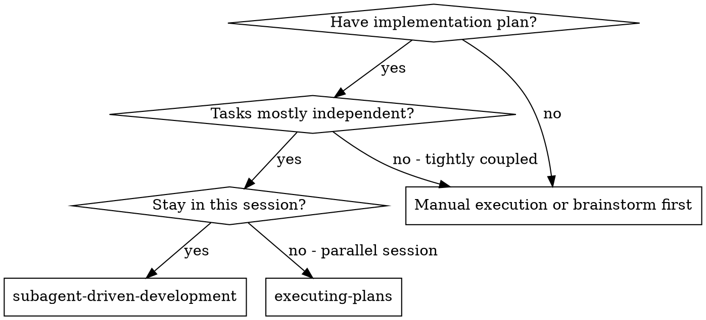
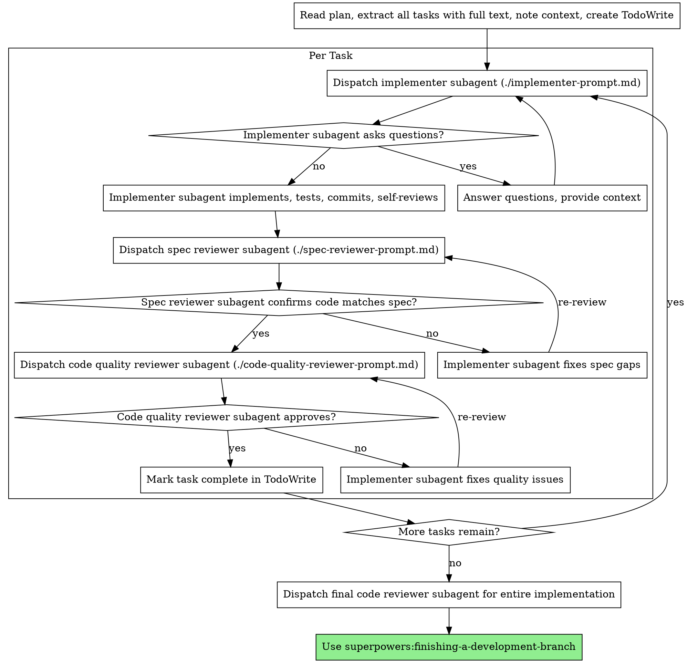

# Subagent-Driven Development

각 task마다 fresh subagent를 파견해 계획을 실행합니다. 각 task 뒤에는 두 단계 review를 진행합니다. 먼저 spec compliance review, 그다음 code quality review입니다.

**subagent를 쓰는 이유:** 전문 agent에게 격리된 context로 작업을 위임합니다. agent가 집중하고 성공하도록 지시와 context를 정확히 구성하세요. agent는 현재 세션의 context나 history를 물려받으면 안 됩니다. 필요한 것만 직접 구성해 제공하세요. 이렇게 하면 자신의 context는 조율 작업에 보존됩니다.

**핵심 원칙:** task마다 fresh subagent + 두 단계 review(spec then quality) = 높은 품질과 빠른 반복

## 사용할 때



**vs. Executing Plans (parallel session):**

- 같은 세션에서 진행합니다.
- task마다 fresh subagent를 사용해 context pollution을 막습니다.
- 각 task 뒤에 두 단계 review를 합니다: spec compliance 먼저, 그다음 code quality.
- task 사이에 human-in-loop를 기다리지 않아 더 빠르게 반복합니다.

## 프로세스



## 모델 선택

비용을 아끼고 속도를 높이기 위해 각 역할을 처리할 수 있는 가장 약한 모델을 사용하세요.

**Mechanical implementation tasks** (격리된 함수, 명확한 spec, 1-2 files): 빠르고 저렴한 모델을 사용하세요. 계획이 잘 지정되어 있으면 대부분의 구현 task는 mechanical입니다.

**Integration and judgment tasks** (multi-file coordination, pattern matching, debugging): standard model을 사용하세요.

**Architecture, design, and review tasks:** 사용 가능한 가장 유능한 모델을 사용하세요.

**Task complexity signals:**

- 완전한 spec으로 1-2 files만 touch -> cheap model
- integration concern과 함께 여러 files touch -> standard model
- design judgment나 넓은 codebase 이해 필요 -> most capable model

## Implementer 상태 처리

Implementer subagent는 네 가지 status 중 하나를 보고합니다. 각각에 맞게 처리하세요.

**DONE:** spec compliance review로 진행합니다.

**DONE_WITH_CONCERNS:** 작업은 완료했지만 의문을 표시했습니다. 진행하기 전에 concern을 읽으세요. correctness나 scope 관련이면 review 전에 처리하세요. 관찰 사항이면 기록하고 review로 진행하세요.

**NEEDS_CONTEXT:** 제공되지 않은 정보가 필요합니다. 누락된 context를 제공하고 다시 파견하세요.

**BLOCKED:** task를 완료할 수 없습니다. blocker를 평가하세요.

1. context 문제이면 더 많은 context를 제공하고 같은 모델로 다시 파견합니다.
2. 더 많은 추론이 필요하면 더 유능한 모델로 다시 파견합니다.
3. task가 너무 크면 더 작은 조각으로 나눕니다.
4. 계획 자체가 틀렸으면 사람에게 escalate합니다.

escalation을 무시하거나 변화 없이 같은 모델에게 억지로 재시도시키지 마세요. implementer가 막혔다고 했다면 무언가가 바뀌어야 합니다.

## Prompt Templates

- `./implementer-prompt.md` - implementer subagent 파견
- `./spec-reviewer-prompt.md` - spec compliance reviewer subagent 파견
- `./code-quality-reviewer-prompt.md` - code quality reviewer subagent 파견

## 예시 워크플로

```text
You: I'm using Subagent-Driven Development to execute this plan.

[Read plan file once: docs/superpowers/plans/feature-plan.md]
[Extract all 5 tasks with full text and context]
[Create TodoWrite with all tasks]

Task 1: Hook installation script

[Get Task 1 text and context (already extracted)]
[Dispatch implementation subagent with full task text + context]

Implementer: "Before I begin - should the hook be installed at user or system level?"

You: "User level (hooks/)"

Implementer: "Got it. Implementing now..."
[Later] Implementer:
  - Implemented install-hook command
  - Added tests, 5/5 passing
  - Self-review: Found I missed --force flag, added it
  - Committed

[Dispatch spec compliance reviewer]
Spec reviewer: Spec compliant - all requirements met, nothing extra

[Get git SHAs, dispatch code quality reviewer]
Code reviewer: Strengths: Good test coverage, clean. Issues: None. Approved.

[Mark Task 1 complete]

Task 2: Recovery modes

[Get Task 2 text and context (already extracted)]
[Dispatch implementation subagent with full task text + context]

Implementer: [No questions, proceeds]
Implementer:
  - Added verify/repair modes
  - 8/8 tests passing
  - Self-review: All good
  - Committed

[Dispatch spec compliance reviewer]
Spec reviewer: Issues:
  - Missing: Progress reporting (spec says "report every 100 items")
  - Extra: Added --json flag (not requested)

[Implementer fixes issues]
Implementer: Removed --json flag, added progress reporting

[Spec reviewer reviews again]
Spec reviewer: Spec compliant now

[Dispatch code quality reviewer]
Code reviewer: Strengths: Solid. Issues (Important): Magic number (100)

[Implementer fixes]
Implementer: Extracted PROGRESS_INTERVAL constant

[Code reviewer reviews again]
Code reviewer: Approved

[Mark Task 2 complete]

...

[After all tasks]
[Dispatch final code-reviewer]
Final reviewer: All requirements met, ready to merge

Done!
```

## 장점

**vs. Manual execution:**

- subagent가 자연스럽게 TDD를 따릅니다.
- task마다 fresh context라 혼란이 적습니다.
- 병렬 안전성이 높습니다. subagent가 서로 간섭하지 않습니다.
- subagent가 작업 전과 작업 중에 질문할 수 있습니다.

**vs. Executing Plans:**

- 같은 세션에서 진행합니다.
- 계속 진행합니다. 기다리는 시간이 적습니다.
- review checkpoint가 자동입니다.

**Efficiency gains:**

- controller가 전체 task text를 제공하므로 file reading overhead가 줄어듭니다.
- controller가 필요한 context만 선별합니다.
- subagent가 완전한 정보를 upfront로 받습니다.
- 질문이 작업 후가 아니라 작업 전에 드러납니다.

**Quality gates:**

- self-review가 handoff 전에 issue를 잡습니다.
- 두 단계 review: spec compliance, then code quality
- review loop가 fix가 실제로 작동하는지 보장합니다.
- spec compliance가 over/under-building을 막습니다.
- code quality가 구현 품질을 보장합니다.

**Cost:**

- task마다 implementer + 2 reviewers로 subagent invocation이 늘어납니다.
- controller가 upfront task 추출 등 prep work를 더 합니다.
- review loop가 iteration을 추가합니다.
- 하지만 issue를 일찍 잡아 나중 debugging보다 저렴합니다.

## 위험 신호

**절대 하지 마세요:**

- 명시적인 사용자 동의 없이 `main`/`master` 브랜치에서 구현 시작
- review 건너뛰기(spec compliance 또는 code quality)
- 고치지 않은 issue를 두고 진행
- 여러 implementation subagent를 병렬 파견(conflict)
- subagent가 plan file을 읽게 하기. full text를 제공하세요.
- scene-setting context 생략. subagent는 task가 어디에 맞는지 알아야 합니다.
- subagent 질문 무시. 진행 전에 답하세요.
- spec compliance에서 "close enough" 수용. spec reviewer가 issue를 찾으면 완료가 아닙니다.
- review loop 생략. reviewer가 issue를 찾으면 implementer가 고치고 다시 review합니다.
- implementer self-review를 실제 review 대체물로 사용. 둘 다 필요합니다.
- **spec compliance가 승인되기 전에 code quality review 시작**. 순서가 틀립니다.
- review 중 열린 issue가 있는데 다음 task로 이동

**subagent가 질문하면:**

- 명확하고 완전하게 답하세요.
- 필요하면 추가 context를 제공하세요.
- 구현으로 서두르게 하지 마세요.

**reviewer가 issue를 찾으면:**

- implementer, 즉 같은 subagent가 고칩니다.
- reviewer가 다시 review합니다.
- 승인될 때까지 반복합니다.
- re-review를 건너뛰지 마세요.

**subagent가 task에 실패하면:**

- 구체적인 지시와 함께 fix subagent를 파견하세요.
- 직접 고치려 하지 마세요. context pollution이 생깁니다.

## 통합

**필수 워크플로 스킬:**

- **superpowers:using-git-worktrees** - REQUIRED: 시작 전에 격리된 workspace를 설정하세요. Windows가 아니면 먼저 OS 환경 스킬을 불러오세요.
- **superpowers:writing-plans** - 이 스킬이 실행할 계획을 만듭니다.
- **superpowers:requesting-code-review** - reviewer subagent용 code review template입니다.
- **superpowers:finishing-a-development-branch** - 모든 작업 후 개발을 완료합니다.

**Subagents should use:**

- **superpowers:test-driven-development** - subagent는 각 task에서 TDD를 따릅니다.

**Alternative workflow:**

- **superpowers:executing-plans** - 같은 세션 실행 대신 parallel session에서 사용합니다.
