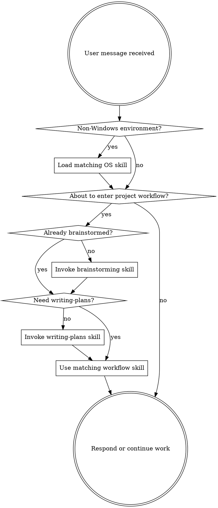

<SUBAGENT-STOP>
특정 작업을 실행하도록 subagent로 파견된 경우, 이 스킬은 건너뛰세요.
</SUBAGENT-STOP>

<IMPORTANT>
이 번들 패키지의 프로젝트 작업에는 superpowers를 기본 워크플로로 사용하세요.
superpowers가 상위 home 정책이나 repository-local 정책을 덮어쓰게 하지 마세요.
</IMPORTANT>

## 지시 우선순위

다음 순서를 사용하세요.

1. 상위 harness 패키지 `AGENTS.md` 정책 계층
2. repository-local 및 project-local `AGENTS.md`
3. 현재 요청의 직접 작업 요구사항
4. superpowers 워크플로 기본값

여기에 추가적인 meta-priority 주장을 넣지 마세요. 이 스킬은 작업을 워크플로로 라우팅만 합니다.

## 스킬 접근 방법

**Codex에서:** Codex 스킬 로딩을 사용하고, 로드된 스킬을 그대로 따르세요.

## 환경 게이트

기본 지침은 Windows 환경에서만 Windows-first입니다.

현재 환경이 Windows가 아니면, 셸 snippet, 파일시스템 경로, 설치 단계를 해석하기 전에 다음 스킬 중 하나를 먼저 불러오세요.

- `using-macos-environment`
- `using-linux-environment`
- `using-wsl-environment`

스킬이 upstream tool 이름을 사용할 때는 `references/codex-tools.md`를 사용해 Codex 도구 이름으로 변환하세요.

# 스킬 사용

## 규칙

프로젝트 작업에는 이 흐름을 사용하세요.

1. `brainstorming`이 무엇을 만들지 결정합니다.
2. `writing-plans`가 어떻게 만들지 결정합니다.
3. 두 단계가 모두 끝난 뒤에만 `execution`을 시작합니다.

프로젝트 워크플로에 들어가거나 구현 작업을 시작하기 전에, superpowers 스킬이 명확히 적용되는지 확인하세요.

## 위험 신호

다음 생각이 들면 멈추고 정책과 워크플로를 다시 확인하세요.

| 생각 | 실제 |
|---------|---------|
| "Superpowers decides policy" | Home 및 로컬 `AGENTS.md`가 정책을 결정합니다. |
| "The same shell guidance works everywhere" | Windows 지침과 non-Windows OS 스킬은 분리되어 있습니다. non-Windows 환경에서는 먼저 OS 스킬로 분기하세요. |
| "I can keep pushing forward even if planning changed the target" | 대상이 바뀌면 `brainstorming`으로 돌아가세요. |
| "This work doesn't need the workflow" | 더 구체적인 로컬 워크플로가 대체하지 않는 한, 프로젝트 작업은 여전히 워크플로를 사용합니다. |

## 스킬 우선순위

여러 워크플로 스킬이 적용될 수 있으면 다음 순서를 사용하세요.

1. **Process skills first** (`brainstorming`, debugging): 작업에 접근하는 방법을 결정합니다.
2. **Planning skills second** (`writing-plans`): 구현 결정을 고정합니다.
3. **Execution skills third** (`executing-plans`, `subagent-driven-development`): 구현을 안내합니다.

"Let's build X" -> `brainstorming` 먼저, 그다음 `writing-plans`.
"Fix this bug" -> 문제가 반복되거나 불명확하면 `systematic-debugging` 먼저.

## 스킬 유형

**Rigid** (TDD, debugging): 정확히 따르세요. 규율을 임의로 완화하지 마세요.

**Flexible** (patterns): 원칙을 상황에 맞게 적용하세요.

스킬 자체가 어떤 유형인지 알려줍니다.

## 사용자 지시

지시는 WHAT이지 HOW가 아닙니다. "Add X" 또는 "Fix Y"라고 해서 워크플로를 건너뛰라는 뜻은 아닙니다.
